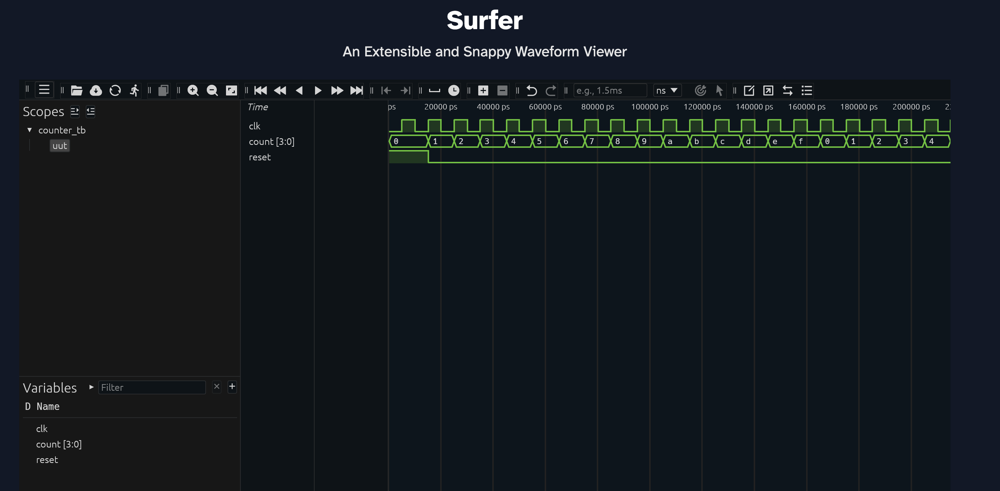

# 4-bit Binary Counter

A synchronous 4-bit binary counter with active-high reset, implemented in Verilog.

## Features
- Counts from 0 to 15, wraps around on overflow
- Synchronous reset
- Simulated using Icarus Verilog + GTKWave

## Files
- `counter.v` — RTL design
- `counter_tb.v` — Testbench with VCD dump

## Simulation
```bash
iverilog -Wall -o counter_sim counter.v counter_tb.v
vvp counter_sim
open -a gtkwave counter.vcd
```

## Waveform
